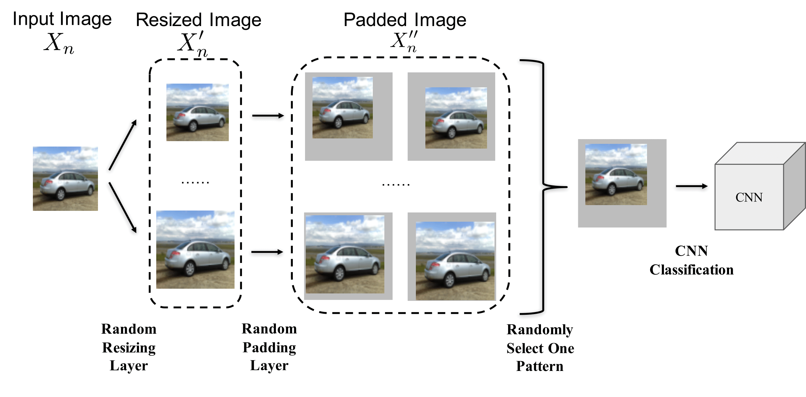

# Mitigating Adversarial Effects Through Randomization

This paper proposed to utilize randomization to mitigate adversarial effects (https://arxiv.org/pdf/1711.01991.pdf). By combining the proposed randomization method with an adversarially trained model, it ranked **No.2** among 107 defense teams in the NIPS 2017 adversarial examples defense challenge (https://www.kaggle.com/c/nips-2017-defense-against-adversarial-attack). 

## The approach

The main ideal of the defense is to utilize randomization to defend adversarial examples:
- Random Resizing: after pre-processing, resize the original image (size of 299 x 299 x 3) to a larger size, Rnd x Rnd x 3,  randomly, where Rnd is within the range [310, 331). 
- Random Padding: after resizing, pad the resized image to a new image with size 331 x 331 x 3, where the padding size at left, right, upper, bottom are [a, 331-Rnd-a, b, 331-Rnd-b]. The possible padding pattern for the size Rnd is (331-Rnd+1)^2.

In general, the pipeline is shown below:

## Pros 

1. No additional training/finetuning is required
2. Very little computation introduced
3. Compatiable to different networks and different defending methods (i.e., we use randomization + ensemble adversarial training + Inception-Resnet-v2 in our submission)

## Ensemble adversarial training model

- http://download.tensorflow.org/models/ens_adv_inception_resnet_v2_2017_08_18.tar.gz

## Team Member

- Cihang Xie (Johns Hopkins University)
- Zhishuai Zhang (Johns Hopkins University)
- Jianyu Wang (Baidu Research)
- Zhou Ren (Snap Inc.)

## Leaderboard

Our team name is **iyswim**, and our rank is **No.2**.

- https://www.kaggle.com/c/nips-2017-defense-against-adversarial-attack/leaderboard

## Citing this work

If you find this work is useful in your research, please consider citing:

    @inproceedings{xie2017mitigating,
        title={Mitigating Adversarial Effects Through Randomization},
        author={Xie, Cihang and Wang, Jianyu and Zhang, Zhishuai and Ren, Zhou and Yuille, Alan},
        booktitle={International Conference on Learning Representations},
        year={2018}
    }
